# *"How You Doin?"* – Ruby Terminal Application

GitHub repo:

`https://github.com/a-sh-dev/hyd_ruby_terminal_app`

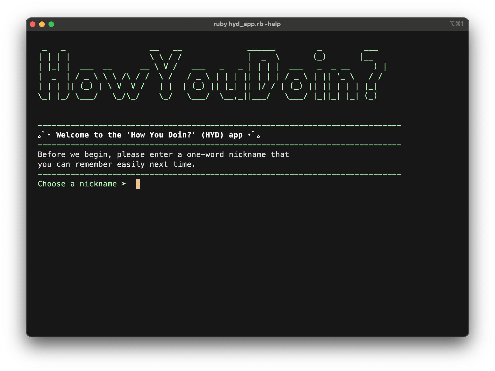

## Installation & Setup

1. `Ruby 2.7.2` and above is required to run the app. Make sure. you have Ruby installed on your local computer. Please refer to [*ruby-lang.org*](https://www.ruby-lang.org/en/documentation/installation/) for installation setup based on your operating system.
2. Download HYD app zip file or clone from the GitHub repository, `https://github.com/a-sh-dev/hyd_ruby_terminal_app`
3. For installation, please run Terminal and make sure you have `bundler` installed. To check, type `bundler -v `, if it's not installed, type `gem install bundler`.
4. Then go to the HYD cloned folder or the downloaded zip extracted folder →  to the `src` folder and type `bundle install` to install all the gems and dependencies required to run the app.
5. Simply type `./hyd_app.sh` to run the program. If permission is denied, please make sure to give access by entering `chmod +x ./hyd_app.sh`
6. Otherwise, you can also enter `ruby hyd_app.rb` or `ruby hyd_app.rb -help` to get some more information through the command line arguments.

# Software Development Plan & Process

## About

### Purpose

**Defining the problem.** Not every day is filled with rainbows and birds chirping in your surroundings. People do have bad days, feel down, sad, discouraged or simply bored. When they are not feeling positive, *it is OK to be not OK*, it is part of being human that we have emotions. 

***How You Doin?*** (HYD) is a terminal app that aims to provide a little entertainment to the user, in the form of ***dad jokes*** and also a mental health log-sysem to check on how they're doing.

HYD is inspired by Joey's famous pickup line from the sitcom *Friends*. Although he says it flirtatiously and cheekily, it never fails to make the other party laugh or smile every time he says it. It will be ambitious to guarantee users to laugh after using the app (especially with dad jokes!), they may groan, but at least they may *respond* to it! And hopefully, HYD can provide some sort of relief, comfort, or at least a smile and make the user feel better, and then motivates the user to *respond* to any negative feelings they are currently facing, positively. 

HYD's log-system's feature is to record a log of how the user is doing (feeling) when and after using it, so they can track their own mental wellbeing. When needed, HYD also responds to the user by providing mental health advice and helpline as their call to action. 

### Target Audience

Ideally anyone in their 20s to above, who can read English, who is bored or having a bad day, who needs relief and entertainment, who definitely appreciate dad jokes!

### Features

#### Feature 1: User's Log

##### Feature 1.1 – *Record* a log of *<u>how user is doing (feeling)</u>* before and after using the app

- Log is created, saved and retrievable under a user's unique name/nickname to prevent potential duplicates and also to provide privacy
- Log entry details include date, the user's feelings (before and after) and a timestamp for back-end purpose.
- The last 5 entries of the log is displayed after the '*entertainment*' part and just before exiting the app
  - The log entries are for display only and are immutable once stored
- The log keeps track on the user's feeling category before and after using the app and the app will respond to the user accordingly before it quits:
  - Two categories of the user's feelings:
    - *Alert/Concern*: sad / stress / anxious
    - *Normal*: bored / average / happy

##### Feature 1.2 – *Respond* to the user with how they're doing (feeling)

- When the user's feeling is in the *Alert/Concern* category, after the log is displayed, a mental health tips and advice will be displayed subsequently before exiting the app, including a helpline number

#### Feature 2: Entertainment

##### Feature 2.1 – *"How about a laugh?"* 

- Randomise dad jokes
  - The user can generate jokes multiple times
  - User has the option to switch to the other entertainment *(will be implemented at later version)*

##### Features 2.2 –*"How about an encouragement?"*

- Same features as above and will be implemented in the next version.

### User Experience – How to Use

#### Control Flowchart

*Original flowchart*

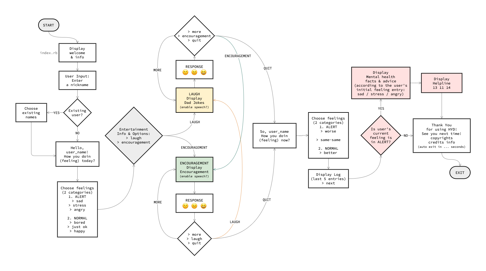

#### Pseudocode (Explaining the User's Journey)

At the start of the app, a welcome and general app info is displayed.

The user is asked to enter a unique name or nickname to be used to login next time and to access their log (at this point, password is not available yet).

User then is greeted with their name and asked, "*How you doin (feeling), today?"* – Greetings will be displayed differently. For an existing user, a  "Welcome back!" is displayed and the next section follow immediately. For a new user, a basic information about the log system is introduced first.

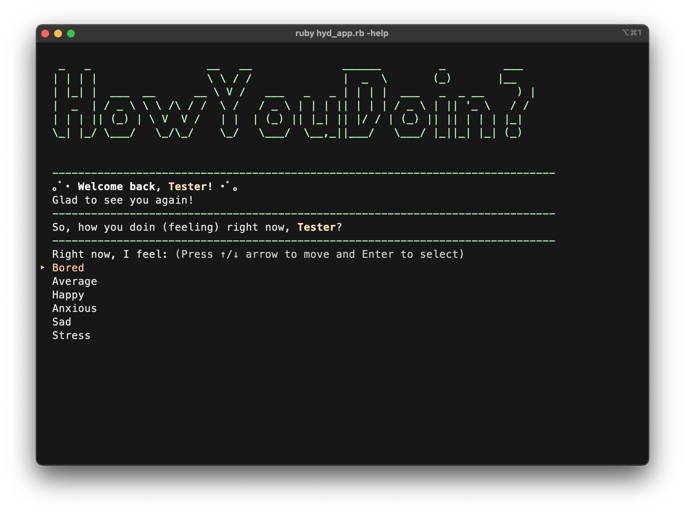

↑  For an existing user

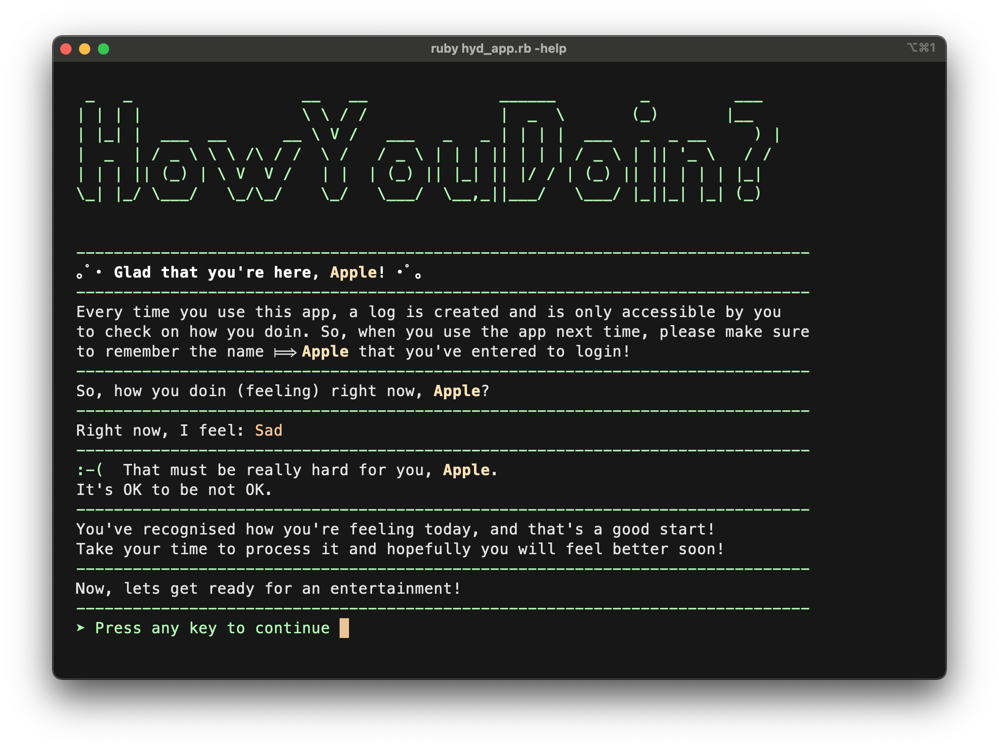

↑  For a new user – displaying the response when their feeling is in the concern/alert category.

The app also functions to track the user's feeling. There are two entry points for keeping track of 'today's entry', below is the first entry, and when they decide to 'call it a day' (end the app), the last one is prompted to update their feeling.

There are two categories of feelings that the user can choose (the two category names are not visible to the user, only for back-end purpose):

- *Alert/Concern* category:
  - Sad
  - Stress
  - Anxious
- *Normal* category:
  - Bored
  - Just OK
  - Happy

The two main Entertainment info and options are displayed *(at this stage only the laugh is implemented)*:

- ***How about a laugh?***
  - A (randomised) dad joke is displayed. Every dad joke is a set of short two parts. They are displayed between an interval of  3-5 few seconds
  - Subsequenty, three options are available:
    - More
    - How about an encouragement? *(not yet implemented)*
    - Call it a day
- ***How about an encouragement?*** *(not available yet – will be implemented at a later version)*
  - Generally the same as above
  - Subsequenty, three options are available:
    - More
    - How about a laugh? 
    - Call it a day

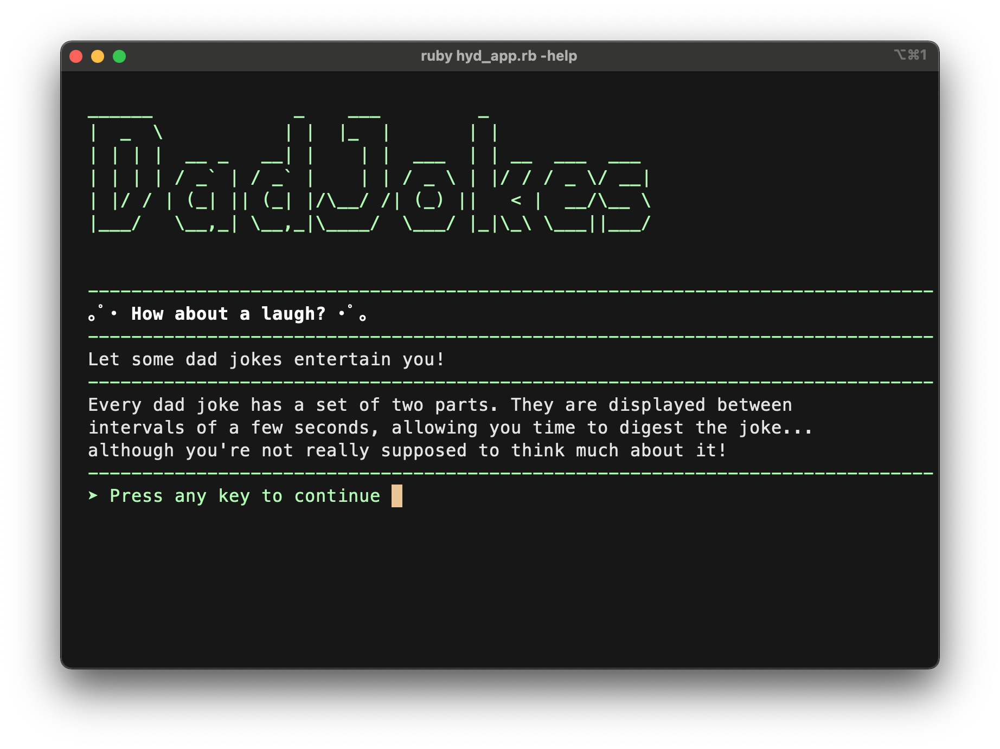

↑   The display just before the randomise jokes method is called.

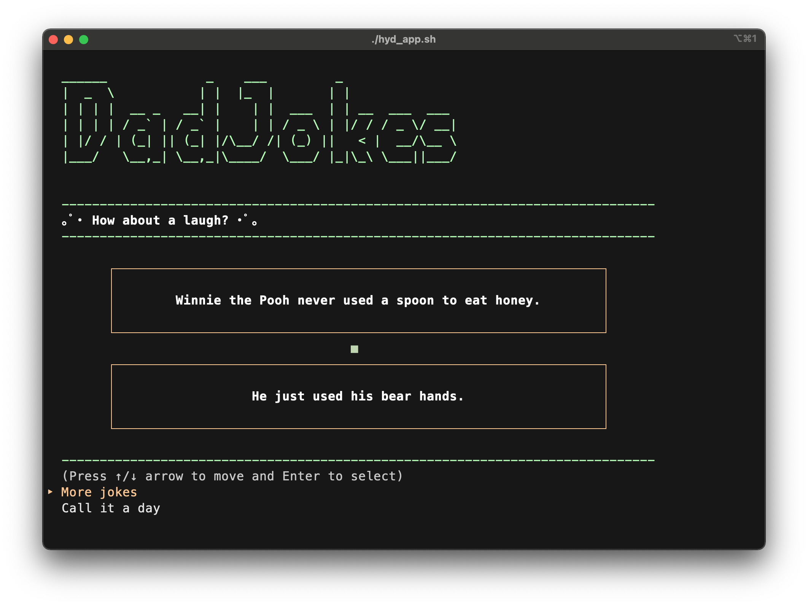

↑  Randomised dad-jokes features

When the user calls it a day, the last entry point is prompted to update how they're feeling, by displaying *"So, user_name... How you doing (feeling) now?"*. 

- *Ideally*, this last log-sytem part should be asking if the user is feeling: **better**, **worse** or **the same** (nothing change). Under the better or worse options, the user also inputs the scale of it. For example, from the scale of 1-10, how worse/better their feeling is now. *(future implementation plan)*
- For this version, the user will be asked the same question as the first time they're asked, 
  - *Alert/Concern* category:
    - Sad
    - Stress
    - Anxious
  - *Normal* category:
    - Bored
    - Just OK
    - Happy

In the back-end, the user's 'today entry' is finalised and saved into the user's file to be processed for the 5 last log entries display.

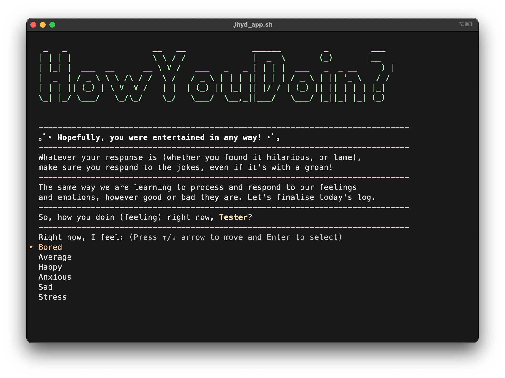

↑  Updating the user's feeling to finalise the log entry.

The last 5 entries of the log is displayed according to the date and their feelings before and after (in descending order). The user can navigate to the next screen to move on.

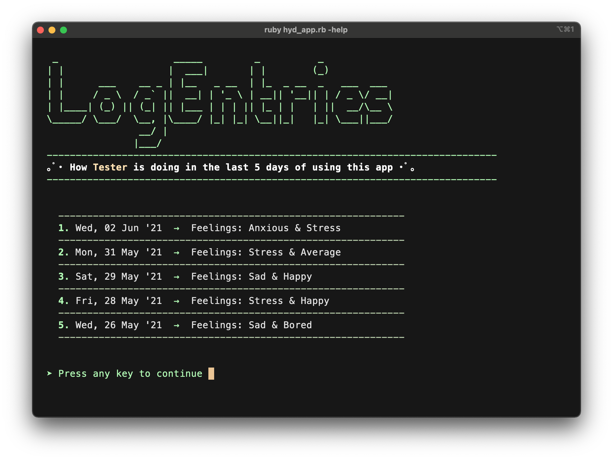

↑  Displaying last 5 log entries in descending order.

If the user's current or updated feeling is in the *alert/concern* category, a general mental health tips, advice and helpline will be displayed.

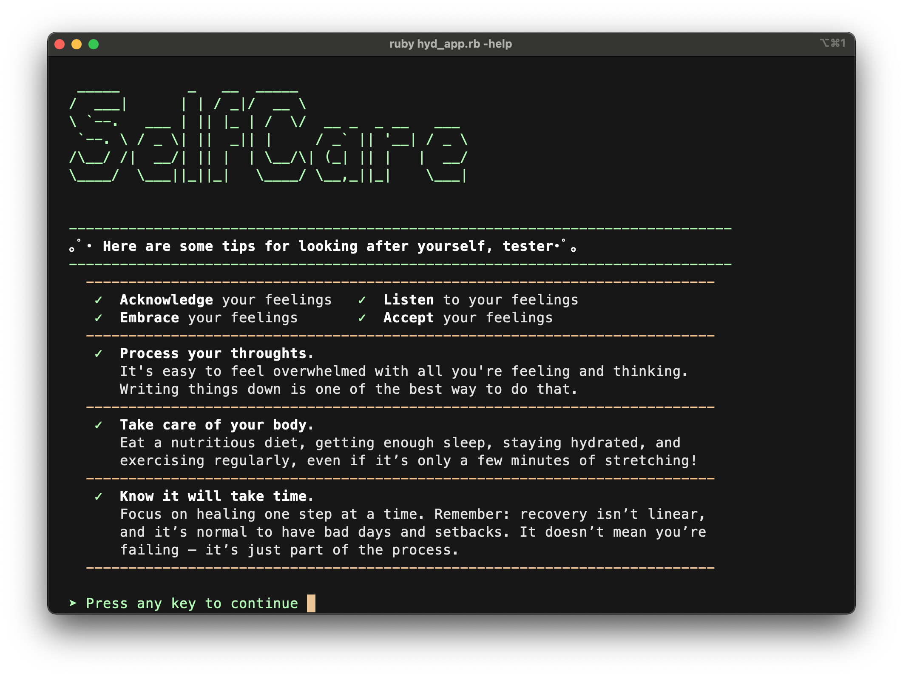

↑  Mentalhealth section is called when the app responds to the user's feeling that is in the concern/alert category.

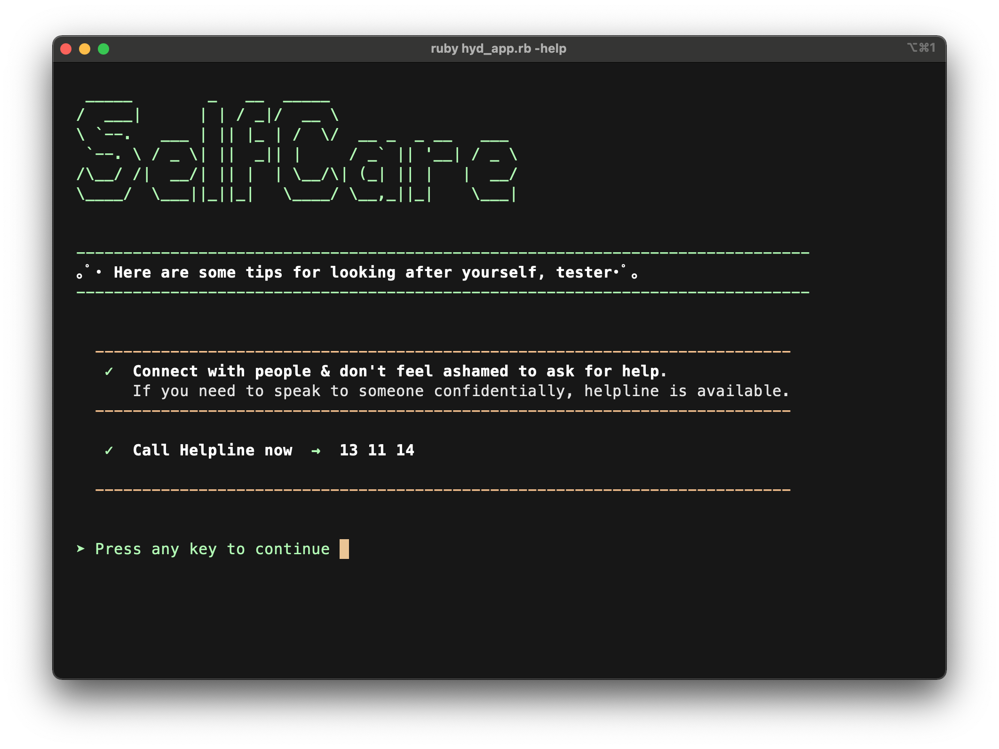

Subsequently a thank you for using the app is displayed with short copyright and credit info. If the user's feeling is not in the alert category, the thank you message is displayed immediately after they navigate from the log entries display section.

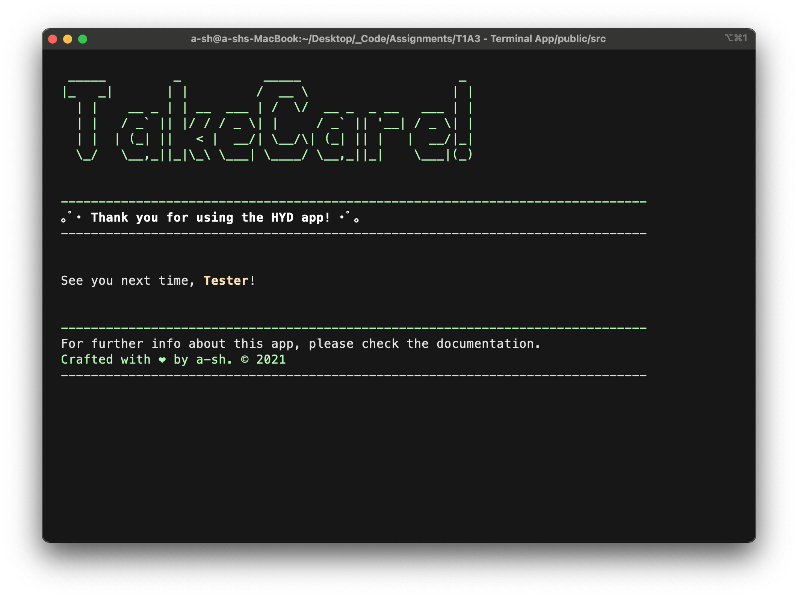

#### HYD Data Structure Flowchart

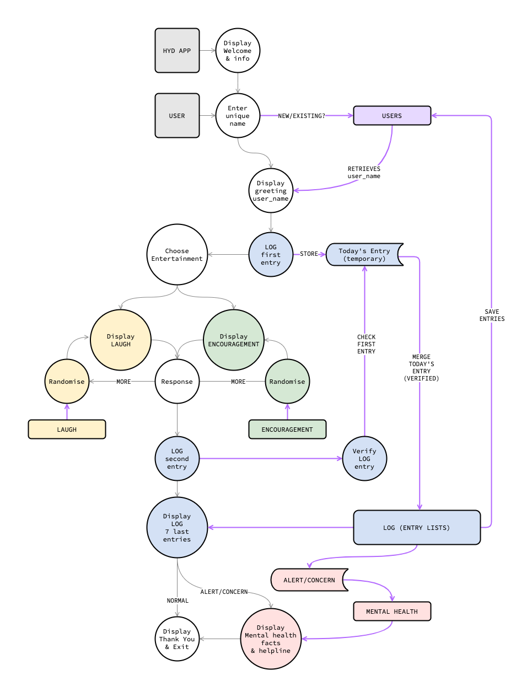

### User Interface, Interaction & Enhancements

The tone of the app is positive, chill and friendly. The chosen words throughout the app is assuring, sympathetic and considerate. For example, not using the word 'quit' to end the program, preventing any harmful negative thoughts for the worse-case scenario.

#### Ruby Gems Files Integrations

1. Easy navigation (up and down arrow navigations) to prevent mistyping and robust prompt features with validations – [*TTY prompt*](https://github.com/piotrmurach/tty-prompt)
2. ASCII art text generator page header / title – [*TTY font*](https://github.com/piotrmurach/tty-font)
4. UI add-ons, text colors – [*Rainbow*](https://github.com/sickill/rainbow)
5. UI add-ons, another text colors – [*Colorize*](https://github.com/fazibear/colorize) 
6. UI add-ons, to display (short) dad jokes and improve better readability and visualisation – [*TTY Box*](https://github.com/piotrmurach/tty-box)
7. UI add-ons, an animated spinner to display 'loading time' allowing user to think – [*TTY Spinner*](https://github.com/piotrmurach/tty-spinner)
8. Data persistence feature for saving and accessing structured data files – [*JSON*](https://flori.github.io/json/)

### Limitations & Future Development Plan

- Due to time constraints, only the dad-jokes (*How about a Laugh?*) part is implementable. Hope to be able to implement more entertainment, such as encouragements (with proper permissions obtained for external sources) and perhaps simple word guessing games.
- Possiblity to add dad-jokes API integration for more maintainable external sources.
- Randomised jokes can be filtered so each joke only displayed once. There are currently 50 jokes in the provided material.
- Speech features didn't work in this version, hope to be able to implement a text-to-speech feature. 
- Log-system future development plan:
  - Implement the *'better or worse (with scale-measure slider) or same-same'* options to finalise log entry.
  - Possibility to add more feelings and emotions in the option list and a function to describe user's own emotions as well as adding short descriptions for the user log entries. 
  - Add a feature to send log entries to user's e-mail.

### Credits

Dad jokes materials are based on *David Williams's 'The Greatest, Most Awesome Collection of Dad Jokes ... Ever"*,  [Amazon link](https://www.amazon.com/greatest-most-awesome-collection-Jokes-ebook/dp/B0894XJ1L4).

Mental health materials are based on [*Mental Health America*](https://mhanational.org/mental-health-month).

## Manual Testing

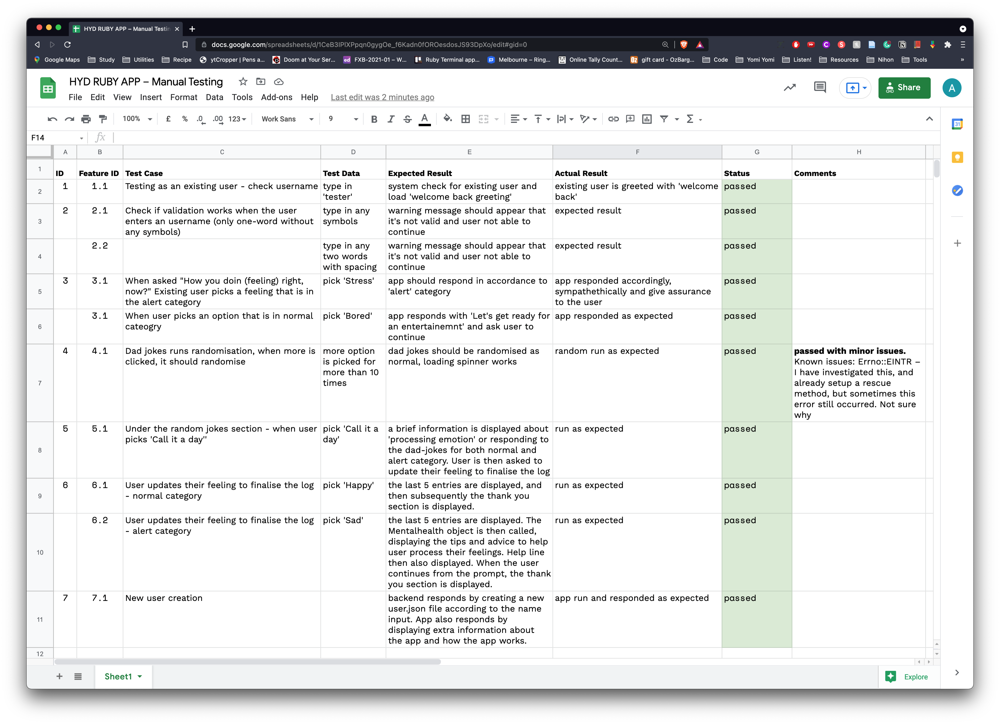

GoogleDoc manual testing  →  [*link*](https://docs.google.com/spreadsheets/d/1CeB3IPlXPpqn0gygOe_f6Kadn0fOROesdosJS93DpXo/edit?usp=sharing).

## Project Development Documentation

*Trello documentations – for project management*

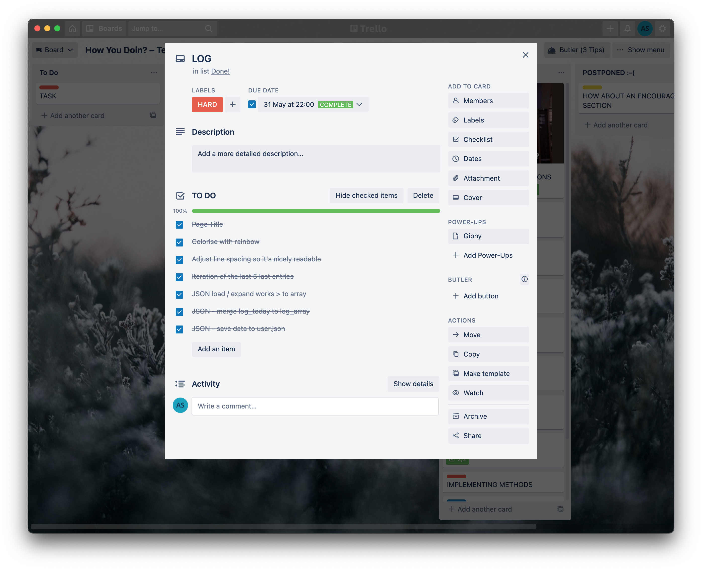

More screenshots are available in the `./ppt/hyd_slides.pdf`

---

**As part of Coder Academy FX21-01 T1A3 Assignment**

Crafted with ❤  by a-sh © 2021
